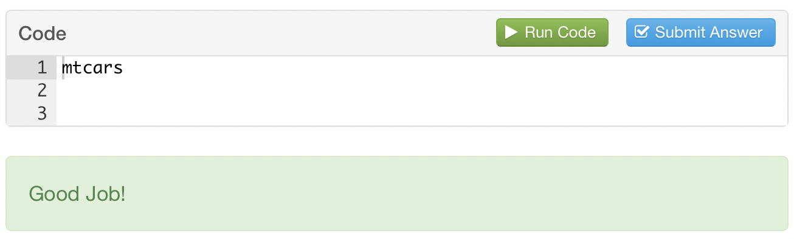
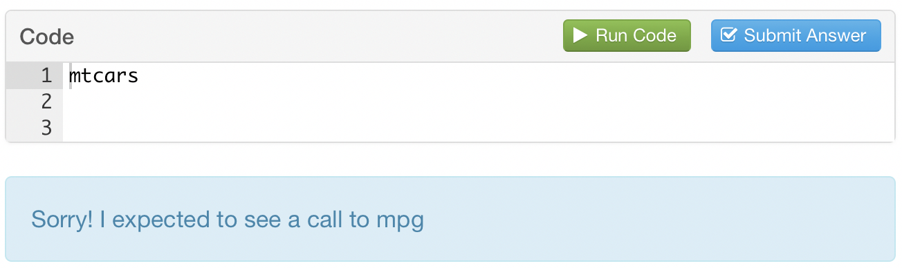
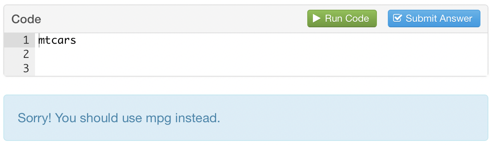
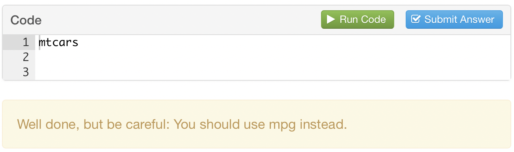
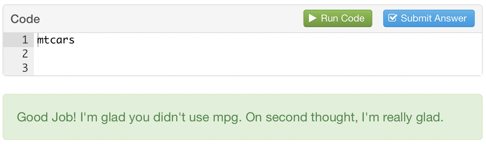

magrader
================

`magrader` creates a simple checking scheme based on [magrittr](https://github.com/tidyverse/magrittr) pipes for [tutor](https://rstudio.github.io/tutor/index.html) tutorials.

With `magrader`, authors write checks as pipes that pass student submissions from one check to the next. Authors can refer to the submission as `.answer` (which could be complemented in the future with `.result`), and they can do this in a natural way: `magrader` hides the non-standard evaluation that occurs behind the scenes. In other words, a tutor author can directly manipulate the student answer as if they were using magrittr pipes in a normal R environment.

`magrader` is an experiment, a proof-of-concept. As a result, it only implements one checking function.

Examples
========

`magrader` supplies the `code_calls()` function, which checks whether a piece of student code calls an R function or object. To use `code_calls()`, recreate the exercise and `-check` chunk in the <a href="https://raw.githubusercontent.com/rstudio/ggtutorials/master/000-grading-demo-magrader/000-grading-demo-magrader.Rmd?token=AAFMFtBlSAPOY0HciQnONxe9FakESlvmks5YwZKNwA%3D%3D" download="demo.Rmd">demo tutor file</a>.

To check student code with `code_calls()`:

1.  Add to the tutorial's setup chunk:

    ``` r
    library(tutor)
    library(magrader)
    library(magrittr)
    tutor_options(exercise.checker = pipe_checker)
    ```

2.  Write a pipe that begins with `.answer` in an exercise's `-check` chunk, e.g.

    ``` r
    .answer %>% 
      code_calls("mtcars")
    ```

`magrader` will run each check in the pipe, in order, on the code. Let's assume that the student's answer in the tutor exercise consisted of exactly `mtcars`. Then the short pipe above will return the result:



To add multiple checks, extend the pipe. Notice that `magrader` will skip downstream checks as soon as a check returns a failure. So the checking code below would return the image that follows

``` r
.answer %>% 
  code_calls("mpg") %>% 
  code_calls("mtcars") 
```



You can customise the failure message with `message`:

``` r
.answer %>% 
  code_calls("mpg", message = "You should use mpg instead.") %>% 
  code_calls("mtcars") 
```



Check failures need not be catastrophic. Set `warn = TRUE` to treat the failure as a warning. In this case, `magrader` will run downstream checks. As long as the code does not fail a downstream check, the warning message will be printed as part of its feedback.

``` r
.answer %>% 
  code_calls("mpg", message = "You should use mpg instead.", warn = TRUE) %>% 
  code_calls("mtcars") 
```



You can also praise your students for right answers, or provide inocuous comments with `praise`. When appropriate, `magrader` will combine multiple messages.

``` r
.answer %>% 
  code_calls("mtcars", praise = "I'm glad you didn't use mpg.") %>% 
  code_calls("mtcars", praise = "On second thought, I'm really glad.")
```


